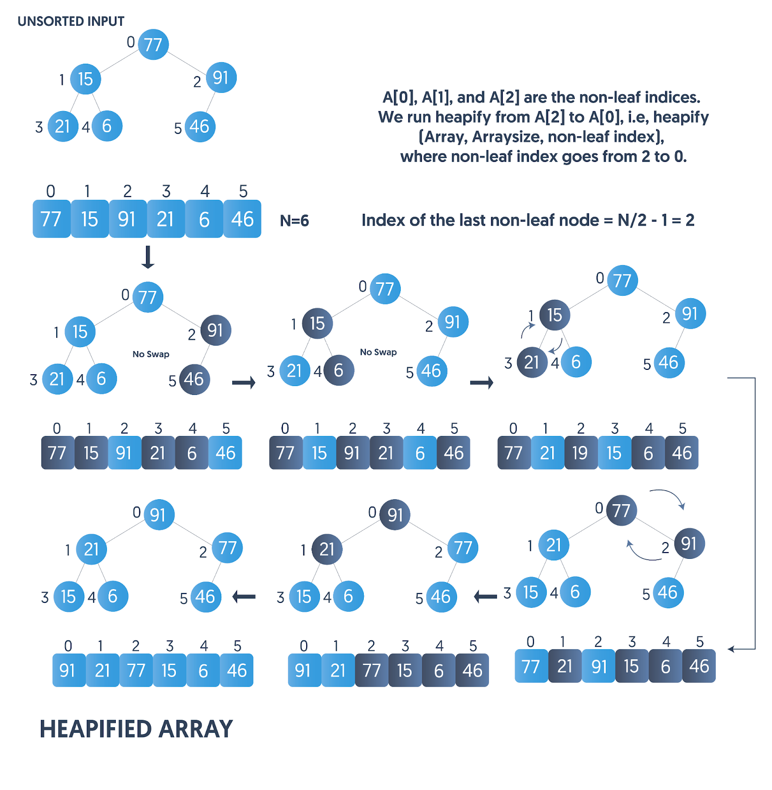

# Intuition 

A max-heap is a tree that maintains the property of having parents larger than its children. We can use this data structure to continuously extract the largest element and sort it.

- **Step 1** : We transform our array into a heap.
- **Step 2** : Swap the root of our heap with the last element and heapify the remaining portion.

Heapify: Transforming an array into a heap.

# Building the code

We need a function to make sure that the heap property is maintained. This function takes the array and checks the heap property for one root.

```c++
void heapify(int* array, int size, int root) {
	int largest = root;
	
	// indices for left and right subtrees
	int left = 2 * root + 1;
	int right = 2 * root + 2;
}
```

We check if the left and the right nodes are larger than the root. 

```c++
if (left < size && array[left] > array[largest])
	largest = left;

if (right < size && array[right] > array[largest])
	largest = right;
```

Swap to make sure that the root has the largest element.

```c++
if (largest != root) {
	std::swap(array[root], array[largest]);
	
	// recursively make sure that the children are well heapified
	heapify(array, size, largest); 
}
```

Now we need the main sorting function. 

```c++
void heap_sort(int* array, int size) {
	// don't have to heapify the last level as they don't have any children
	for (int i = size / 2 - 1; i >= 0; i--)
		heapify(array, size, i); 
		
	// continuously reheapify 
	for (int i = size - 1; i > 0; i--) {
		std::swap(array[0], array[i]);
		heapify(array, i, 0);  
	}
}
```

# Code

```c++
#include <iostream>

void heapify(int* array, int size, int root) {
	int largest = root; 
	int left = 2 * root + 1; 
	int right = 2 * root + 2; 

	if (left < size && array[left] > array[largest])
		largest = left;

	if (right < size && array[right] > array[largest])
		largest = right;

	if (largest != root) {
		std::swap(array[root], array[largest]);
		heapify(array, size, largest); 
	}
}

void heap_sort(int* array, int size) {
	for (int i = size / 2 - 1; i >= 0; i--)
		heapify(array, size, i); 

	for (int i = size - 1; i > 0; i--) {
		std::swap(array[0], array[i]);
		heapify(array, i, 0);  
	}
}

int main()
{
	int array[] = {5, 3, 1, 2, 6, 5};
	heap_sort(array, 6);

	for (auto i : array)
		std::cout << i << '\n';

	return 0;
}
```

# Algorithm

```
Algorithm Heapify(ARRAY, size, root)
{
	largest = root;
	left = 2 * root + 1;
	right = 2 * root + 2;
	
	if (left < size and ARRAY[left] > ARRAY[largest])
		largest = left;
	
	if (right < size and ARRAY[right] > ARRAY[largest])
		largest = right;
		
	if (largest != root)
	{
		swap(ARRAY[root], ARRAY[largest]);
		Heapify(ARRAY, size, largest);
	}
}

Algorithm HeapSort(ARRAY, size)
{
	for (i = size / 2 - 1 to 0)
		Heapify(ARRAY, size, i);
	
	for (i = size - 1 to 1)
	{
		swap(ARRAY[0], ARRAY[i]);
		Heapify(ARRAY, i, 0);
	}
}
```
