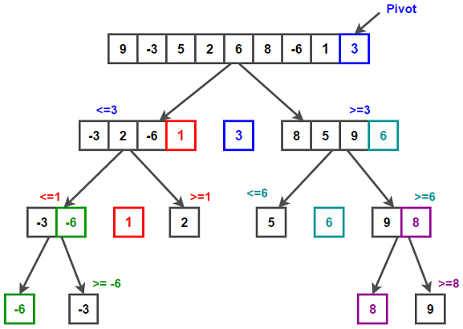

# Intuition

Quick sort is in fact, pretty quick - one of the fastest sorting algorithm ever formulated. 

- **Step 1** : Choose a **pivot**. We are free to choose any part of the array as our pivot. The goal for us is to find the pivot its home.
- **Step 2** : Find the proper place for the pivot by shifting all the elements less than the pivot at the beginning of the array. So, now we place our pivot after "all the elements less than the pivot."
- **Step 3** : Split the array around the pivot and repeat step 1 and 2.

# Building the code

This is an in-place sorting algorithm and thus it sorts its elements in its own place. So, we do not return anything.

```c++
void quick_sort(int* array, int begin, int end)
{
	// base case
	if (begin >= end) return;
	...
}
```

Now we use the two pointer approach, one pointer `i` for keeping track of the places to be filled at the left of the array with the elements smaller than our pivot and the other one `j` for iterating through the array scanning through the possible candidates for swapping with `i`.

```c++
int i = begin - 1;
int j = begin;
```

We choose our pivot to be the **end** of this array in this particular case. When we are done scanning through our array, we choose to place this pivot element right after the current position of `i`. This way, we ensure that the pivot is placed after all the elements smaller than it.

```c++
// scan until the pivot
while (j < end)
{
	// if its less than pivot, swap
	if (array[j] < array[end])
	{
		i++;
		int temp = array[i];
		array[i] = array[j];
		array[j] = temp;
	}
	
	j++;
}
```

Now that we have put all the smaller elements at the beginning of the array, we finally place our pivot at its correct spot, i.e, at `++i`;

```c++
i++;
int temp = array[i];
array[i] = array[end];
array[end] = temp;
```

And then recursively apply the same method to the left half and the right half around the pivot.

```c++
quick_sort(array, begin, i - 1);
quick_sort(array, i + 1, end);
```

# Code

```c++
#include <iostream>

void quick_sort(int* array, int begin, int end)
{
	if (begin >= end) return;
	
	int i = begin - 1;
	int j = begin;
	while (j < end)
	{
		if (array[j] < array[end])
		{
			i++;
			int temp = array[i];
			array[i] = array[j];
			array[j] = temp;
		}
		
		j++;
	}
	
	i++;
	int temp = array[i];
	array[i] = array[end];
	array[end] = temp;
	
	quick_sort(array, begin, i - 1);
	quick_sort(array, i + 1, end);
}	

int main()
{
	int array[] = {8, 2, 4, 7, 1, 3, 9, 6, 5};
	quick_sort(array, 0, 8);
	
	for (auto i : array)
		std::cout << i << '\n';
}
```

# Algorithm

```
Algorithm QuickSort(ARRAY, begin, end)
{
	if (begin >= end) return;
	
	i = begin - 1;
	j = begin;
	
	while(j < end)
	{
		if (ARRAY[i] < ARRAY[end])
		{
			i++;
			temp = array[i];
			array[i] = array[i];
			array[j] = temp;
		}
		
		j++;
	}
	
	i++;
	temp = ARRAY[i];
	ARRAY[i] = ARRAY[end];
	ARRAY[end] = temp;
	
	QuickSort(ARRAY, begin, i - 1);
	QuickSort(ARRAY, i + 1, end);
}
```

# Edge Cases

One unhandled edge case remains, when `i` is `begin - 1`  and we need to swap, we swap the first spot which is `begin` with the pivot.
